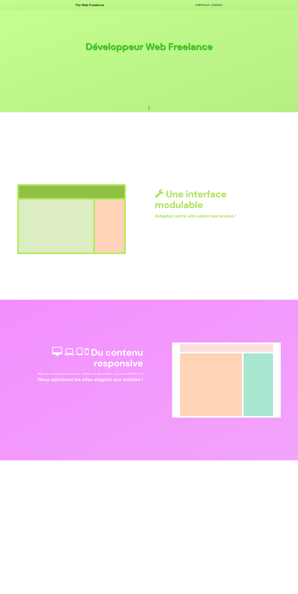

# thewebfreelance
A site used to present my web skills.

Please note that "thewebfreelance" is a temp name and it will change in the future.

### to do
- more simple header on mobile ?

### index preview :

